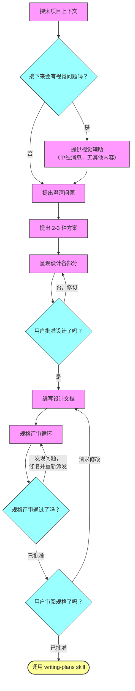

---
name: brainstorming
description: "你必须在进行任何创造性工作之前使用此技能 - 创建功能、构建组件、添加功能或修改行为。它会在实现之前探索用户意图、需求和设计。"
---

# 将想法头脑风暴为设计

通过自然的协作式对话，帮助将想法转化为完整的设计和规格说明。

先理解当前项目上下文，然后一次问一个问题来细化想法。一旦你理解了自己要构建什么，就呈现设计并获得用户批准。

<HARD-GATE>
在你呈现设计并且用户已批准之前，不要调用任何实现类技能，不要编写任何代码，不要为任何项目搭建脚手架，也不要采取任何实现行动。无论项目看起来多么简单，这都适用于每一个项目。
</HARD-GATE>

## 反模式："这太简单了，不需要设计"

每个项目都要经过这个过程。待办清单、单函数工具、配置更改 - 所有这些都一样。"简单"项目正是那些未经检验的假设最容易造成最多浪费工作的地方。设计可以很短（对于真正简单的项目，几句话即可），但你必须呈现它并获得批准。

## 检查清单

你必须为以下每一项创建任务，并按顺序完成它们：

1. **探索项目上下文** - 检查文件、文档、最近的提交
2. **提供视觉辅助**（如果该主题会涉及视觉问题）- 这必须是一条单独的消息，不能与澄清问题合并。见下方的“视觉辅助”部分。
3. **提出澄清问题** - 一次一个，理解目标/约束/成功标准
4. **提出 2-3 种方案** - 说明权衡，并给出你的推荐
5. **呈现设计** - 按其复杂度分成若干部分，在每个部分之后获得用户批准
6. **编写设计文档** - 保存到 `docs/superpowers/specs/YYYY-MM-DD-<topic>-design.md` 并提交
7. **规格评审循环** - 派发 `spec-document-reviewer` 子代理；修复问题并重新派发，直到获得批准（最多 5 次迭代，然后提交给人工处理）
8. **用户审阅书面规格** - 在继续之前，请用户审阅规格文件
9. **过渡到实现** - 调用 `writing-plans` skill 来创建实现计划

## 流程

**终止状态是调用 `writing-plans`。** 不要调用 `frontend-design`、`mcp-builder` 或任何其他实现类技能。在 brainstorming 之后，你调用的唯一技能就是 `writing-plans`。

## 过程

**理解这个想法：**

- 先查看当前项目状态（文件、文档、最近的提交）
- 在提出详细问题之前，先评估范围：如果请求描述了多个独立的子系统（例如，"构建一个包含聊天、文件存储、计费和分析的平台"），要立即指出这一点。不要把问题花在细化一个本来就需要先拆分的项目细节上。
- 如果项目太大，无法用一份规格来覆盖，就帮助用户将其拆分为子项目：有哪些独立部分、它们如何关联、应该按什么顺序构建？然后按照正常的设计流程，只对第一个子项目进行头脑风暴。每个子项目都要有各自独立的 spec -> plan -> implementation 周期。
- 对于范围合适的项目，一次问一个问题来细化这个想法
- 尽可能优先使用多项选择题，但开放式问题也可以
- 每条消息只问一个问题 - 如果某个主题需要更多探索，就将其拆成多个问题
- 聚焦于理解：目标、约束、成功标准

**探索方案：**

- 提出 2-3 种不同方案，并说明权衡
- 以对话方式呈现选项，并给出你的推荐和理由
- 先给出你推荐的选项，并解释原因

**呈现设计：**

- 一旦你认为自己已经理解了要构建什么，就呈现设计
- 每个部分的长度应与其复杂度匹配：如果直接明了，就写几句话；如果有细微差别，可以写到 200-300 字
- 在每个部分之后都要询问用户，到目前为止这是否正确
- 覆盖：架构、组件、数据流、错误处理、测试
- 如果有任何地方说不通，要准备好返回去继续澄清

**为隔离性和清晰性而设计：**

- 将系统拆分为更小的单元，使每个单元都只有一个明确的目的，通过定义良好的接口进行通信，并且可以被独立理解和测试
- 对于每个单元，你都应该能够回答：它做什么、如何使用它、以及它依赖什么？
- 一个单元的作用，别人能否在不阅读其内部实现的情况下理解？你能否在不破坏使用方的前提下修改其内部实现？如果不能，那么边界就需要改进。
- 更小、边界清晰的单元对你自己也更容易操作 - 对于能够一次放进上下文中的代码，你能更好地推理；当文件更加聚焦时，你的修改也更可靠。当一个文件变得很大时，这通常意味着它承担了太多职责。

**在现有代码库中工作：**

- 在提出改动之前，先探索当前结构。遵循现有模式。
- 如果现有代码中存在会影响这项工作的缺陷（例如，一个变得过大的文件、不清晰的边界、纠缠的职责），请将有针对性的改进纳入设计中 - 这正是优秀开发者在他们接手的代码中会做的事情。
- 不要提出无关的重构。始终聚焦于服务当前目标的内容。

## 设计之后

**文档：**

- 将经过验证的设计（spec）写入 `docs/superpowers/specs/YYYY-MM-DD-<topic>-design.md`
  - （如果用户对 spec 位置有偏好，则以用户偏好覆盖该默认值）
- 如果可用，使用 `elements-of-style:writing-clearly-and-concisely` skill
- 将设计文档提交到 git

**规格评审循环：**
写完规格文档后：

1. 派发 `spec-document-reviewer` 子代理（见 `spec-document-reviewer-prompt.md`）
2. 如果发现问题：修复、重新派发、重复此过程，直到获得批准
3. 如果循环超过 5 次迭代，则提交给人工寻求指导

**用户审阅关卡：**
规格评审循环通过后，在继续之前，请用户审阅书面规格：

> "规格已写入并提交到 `<path>`。请审阅它，并告诉我在我们开始编写实现计划之前你是否希望做任何更改。"

等待用户的回复。如果他们要求修改，就进行修改并重新运行规格评审循环。只有在用户批准后才继续。

**实现：**

- 调用 `writing-plans` skill 来创建详细的实现计划
- 不要调用任何其他 skill。下一步就是 `writing-plans`。

## 核心原则

- **一次一个问题** - 不要用多个问题让用户不堪重负
- **优先多项选择** - 相比开放式问题，更容易回答
- **坚决贯彻 YAGNI** - 从所有设计中移除不必要的功能
- **探索替代方案** - 在定案之前，始终提出 2-3 种方案
- **增量式验证** - 呈现设计，获得批准后再继续
- **保持灵活** - 如果哪里讲不通，就回去继续澄清

## 视觉辅助

一个基于浏览器的辅助工具，用于在头脑风暴过程中展示模型图、图表和视觉选项。它以工具形式提供 - 不是一种模式。接受该辅助意味着它可用于那些通过视觉呈现会更合适的问题；这并不意味着每个问题都要通过浏览器来处理。

**提供该辅助：** 当你预期接下来的问题会涉及视觉内容（模型图、布局、图表）时，先单独征求一次同意：
> "如果我能在网页浏览器里展示给你看，我们正在处理的一些内容可能会更容易解释。我可以在过程中整理模型图、图表、对比图以及其他视觉内容。这个功能还比较新，而且可能会消耗较多 token。要试试吗？（需要打开一个本地 URL）"

**这段征求同意的话必须作为单独的一条消息发送。** 不要把它与澄清问题、上下文摘要或任何其他内容组合在一起。该消息必须只包含上面的征求内容，除此之外别无其他。等待用户回复后再继续。如果他们拒绝，就继续进行纯文本头脑风暴。

**逐问题决策：** 即使用户接受了该辅助，对于每一个问题，也要决定是使用浏览器还是终端。判断标准是：**用户通过看会不会比通过读更容易理解？**

- 对于本身就是视觉内容的东西，**使用浏览器** - 模型图、线框图、布局比较、架构图、并排视觉设计
- 对于文本内容，**使用终端** - 需求问题、概念选择、权衡列表、A/B/C/D 文本选项、范围决策

一个关于 UI 主题的问题并不自动意味着它是视觉问题。"这里的 personality 是什么意思？" 是一个概念性问题 - 使用终端。"哪一种向导式布局更好？" 是一个视觉问题 - 使用浏览器。

如果他们同意使用该辅助，在继续之前先阅读详细指南：
`skills/brainstorming/visual-companion.md`
