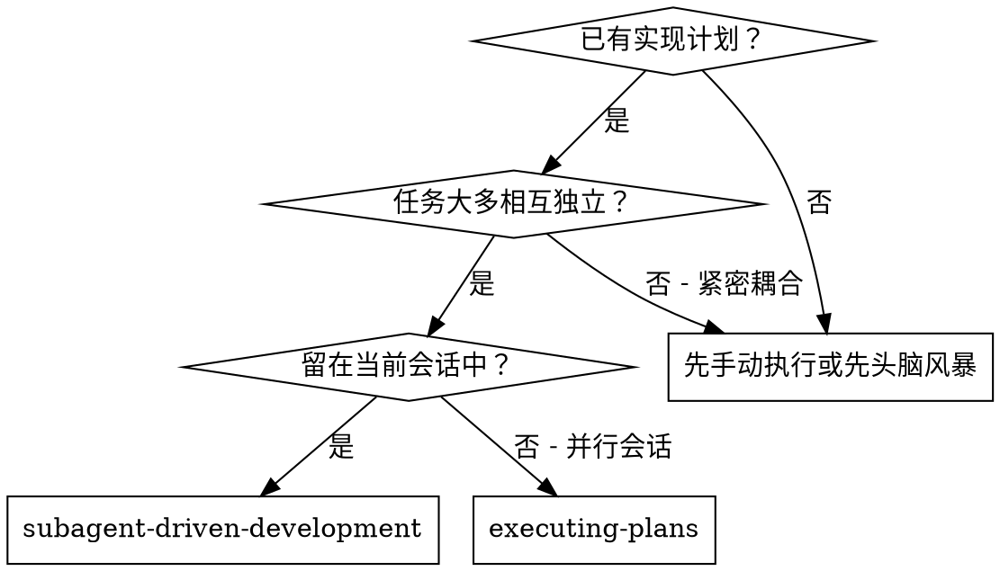
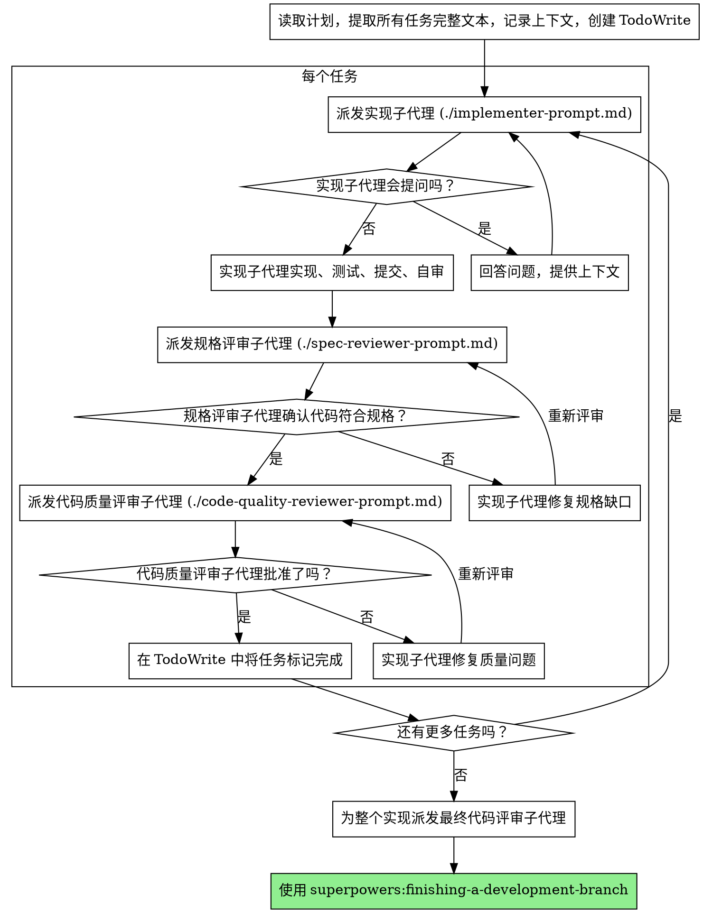

---
name: subagent-driven-development
description: 当你要在当前会话中执行一个由相互独立任务组成的实现计划时使用
---

# 子代理驱动开发

通过为每个任务派发一个全新的子代理来执行计划，并在每个任务之后进行两阶段评审：先做规格符合性评审，再做代码质量评审。

**核心原则：** 每个任务一个全新子代理 + 两阶段评审（规格，然后质量）= 高质量、快速迭代

## 何时使用



**与 Executing Plans（并行会话）相比：**
- 同一会话中进行（无上下文切换）
- 每个任务一个全新子代理（无上下文污染）
- 每个任务后进行两阶段评审：先规格符合性，再代码质量
- 迭代更快（任务之间不需要人类介入）

## 过程



## 模型选择

使用能够胜任每个角色的最低能力模型，以节省成本并提升速度。

**机械型实现任务**（孤立函数、规格清晰、1-2 个文件）：使用快速、廉价的模型。当计划足够明确时，大多数实现任务都是机械型的。

**集成和判断型任务**（多文件协作、模式匹配、调试）：使用标准模型。

**架构、设计和评审任务：** 使用能力最强的可用模型。

**任务复杂度信号：**
- 涉及 1-2 个文件且规格完整 -> 廉价模型
- 涉及多个文件且有集成顾虑 -> 标准模型
- 需要设计判断或广泛的代码库理解 -> 最强模型

## 处理实现者状态

实现子代理会报告四种状态之一。要正确处理每一种：

**DONE：** 进入规格符合性评审。

**DONE_WITH_CONCERNS：** 实现者完成了工作，但标出了疑虑。继续前先阅读这些疑虑。如果疑虑涉及正确性或范围，在评审前先处理。如果它们只是观察（例如“这个文件越来越大了”），记下来并继续评审。

**NEEDS_CONTEXT：** 实现者需要尚未提供的信息。提供缺失的上下文并重新派发。

**BLOCKED：** 实现者无法完成任务。评估这个阻塞：
1. 如果是上下文问题，提供更多上下文，并用相同模型重新派发
2. 如果任务需要更多推理能力，用更强模型重新派发
3. 如果任务太大，把它拆成更小的部分
4. 如果计划本身有问题，升级给人类

**绝不要** 忽略一次升级，或在不做改变的情况下强迫同一个模型重试。如果实现者说它卡住了，就必须有某些事情发生改变。

## 提示模板

- `./implementer-prompt.md` - 派发实现子代理
- `./spec-reviewer-prompt.md` - 派发规格符合性评审子代理
- `./code-quality-reviewer-prompt.md` - 派发代码质量评审子代理

## 工作流示例

```
你：我正在使用子代理驱动开发来执行这个计划。

[读取计划文件一次：docs/superpowers/plans/feature-plan.md]
[提取全部 5 个任务的完整文本和上下文]
[用全部任务创建 TodoWrite]

任务 1：Hook 安装脚本

[获取任务 1 的文本和上下文（已提取）]
[用完整任务文本 + 上下文派发实现子代理]

实现者："开始之前 - 这个 hook 应该安装在用户级还是系统级？"

你："用户级（~/.config/superpowers/hooks/）"

实现者："明白。现在开始实现..."
[稍后] 实现者：
  - 已实现 install-hook 命令
  - 已添加测试，5/5 通过
  - 自审：发现我漏了 --force 标志，已补上
  - 已提交

[派发规格符合性评审者]
规格评审者：规格符合 - 所有需求都已满足，没有额外内容

[获取 git SHA，派发代码质量评审者]
代码评审者：优点：测试覆盖好，代码干净。问题：无。批准。

[将任务 1 标记完成]

任务 2：恢复模式

[获取任务 2 的文本和上下文（已提取）]
[用完整任务文本 + 上下文派发实现子代理]

实现者：[没有问题，直接开始]
实现者：
  - 已添加 verify/repair 模式
  - 8/8 测试通过
  - 自审：一切正常
  - 已提交

[派发规格符合性评审者]
规格评审者：问题：
  - 缺少：进度汇报（规格要求“每 100 项报告一次”）
  - 额外：添加了 --json 标志（未要求）

[实现者修复问题]
实现者：已移除 --json 标志，已添加进度汇报

[规格评审者再次评审]
规格评审者：现在规格符合

[派发代码质量评审者]
代码评审者：优点：扎实。问题（重要）：魔法数字（100）

[实现者修复]
实现者：已提取 PROGRESS_INTERVAL 常量

[代码评审者再次评审]
代码评审者：批准

[将任务 2 标记完成]

...

[所有任务完成后]
[派发最终代码评审者]
最终评审者：所有需求都已满足，可以合并

完成！
```

## 优势

**与手动执行相比：**
- 子代理会自然地遵循 TDD
- 每个任务都是全新上下文（不混乱）
- 对并行安全（子代理彼此不干扰）
- 子代理可以提问（在工作前和工作中都可以）

**与 Executing Plans 相比：**
- 同一会话（无交接）
- 持续推进（无需等待）
- 评审检查点自动化

**效率收益：**
- 没有读文件的开销（控制者提供完整文本）
- 控制者精确整理出所需上下文
- 子代理一开始就拿到完整信息
- 问题会在工作开始前暴露（而不是之后）

**质量关卡：**
- 自审会在交接前先抓出问题
- 两阶段评审：规格符合性，然后代码质量
- 评审循环确保修复确实有效
- 规格符合性能防止过度构建或构建不足
- 代码质量保证实现本身构建得好

**成本：**
- 更多子代理调用（每个任务 1 个实现者 + 2 个评审者）
- 控制者要做更多准备工作（预先提取所有任务）
- 评审循环会增加迭代
- 但能更早发现问题（比后期调试更便宜）

## 红旗

**绝不要：**
- 未经用户明确同意就在 `main`/`master` 分支上开始实现
- 跳过评审（规格符合性或代码质量任一都不行）
- 带着未修复的问题继续推进
- 并行派发多个实现子代理（会冲突）
- 让子代理自己读取计划文件（要直接提供完整文本）
- 跳过场景设定上下文（子代理需要理解任务所处位置）
- 无视子代理的问题（要先回答，再让他们继续）
- 在规格符合性上接受“差不多就行”（规格评审者发现问题 = 还没完成）
- 跳过评审循环（评审者发现问题 = 实现者修复 = 再评审）
- 让实现者的自审替代真实评审（两者都需要）
- **在规格符合性评审通过前就开始代码质量评审**（顺序错误）
- 当任一评审仍有未解决问题时就切换到下一个任务

**如果子代理提问：**
- 清晰且完整地回答
- 如有需要，补充更多上下文
- 不要催他们直接开始实现

**如果评审者发现问题：**
- 由实现者（同一个子代理）修复
- 由评审者再次评审
- 重复直到批准
- 不要跳过重新评审

**如果子代理未能完成任务：**
- 用明确指令派发修复子代理
- 不要自己手动修（会污染上下文）

## 集成

**必需的工作流 skill：**
- **`superpowers:using-git-worktrees`** - 必需：开始前设置隔离的工作区
- **`superpowers:writing-plans`** - 创建由本 skill 执行的计划
- **`superpowers:requesting-code-review`** - 用于评审子代理的代码评审模板
- **`superpowers:finishing-a-development-branch`** - 在所有任务完成后结束开发

**子代理应当使用：**
- **`superpowers:test-driven-development`** - 子代理对每个任务都遵循 TDD

**可选工作流：**
- **`superpowers:executing-plans`** - 用于并行会话，而不是同会话执行
