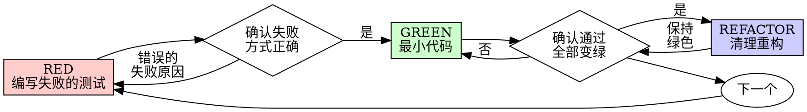

---
name: test-driven-development
description: 当你在实现任何功能或修复任何 bug、且还没有开始编写实现代码时使用
---

# 测试驱动开发（TDD）

## 概述

先写测试。看它失败。再写最小代码让它通过。

**核心原则：** 如果你没有亲眼看见测试失败，你就不知道它测试的是不是正确的东西。

**违反规则的字面含义，就是违反规则的精神。**

## 何时使用

**始终：**
- 新功能
- Bug 修复
- 重构
- 行为变更

**例外情况（需要询问你的人类搭档）：**
- 一次性原型
- 生成代码
- 配置文件

如果你在想“这次就先跳过 TDD 吧”？停下。这是在合理化。

## 铁律

```
没有先失败的测试，就不能写生产代码
```

先写了代码再写测试？删掉它。重新开始。

**没有例外：**
- 不要把它保留为“参考”
- 不要在写测试时“顺手改造”它
- 不要去看它
- 删除就是删除

从测试重新开始实现。就这样。

## 红-绿-重构



### RED - 编写失败的测试

写一个最小测试，展示应该发生什么。

<Good>
```typescript
test('retries failed operations 3 times', async () => {
  let attempts = 0;
  const operation = () => {
    attempts++;
    if (attempts < 3) throw new Error('fail');
    return 'success';
  };

  const result = await retryOperation(operation);

  expect(result).toBe('success');
  expect(attempts).toBe(3);
});
```
名字清晰，测试真实行为，只测一件事
</Good>

<Bad>
```typescript
test('retry works', async () => {
  const mock = jest.fn()
    .mockRejectedValueOnce(new Error())
    .mockRejectedValueOnce(new Error())
    .mockResolvedValueOnce('success');
  await retryOperation(mock);
  expect(mock).toHaveBeenCalledTimes(3);
});
```
名字含糊，测试的是 mock 而不是代码
</Bad>

**要求：**
- 一个行为
- 清晰的名字
- 真实代码（除非无法避免，否则不要用 mock）

### Verify RED - 看着它失败

**强制要求。绝不能跳过。**

```bash
npm test path/to/test.test.ts
```

确认：
- 测试失败（不是报错）
- 失败信息符合预期
- 是因为功能缺失而失败（不是因为拼写错误）

**测试通过了？** 你测试的是现有行为。修正测试。

**测试报错了？** 修复错误，重新运行，直到它以正确方式失败。

### GREEN - 最小代码

写出能让测试通过的最简单代码。

<Good>
```typescript
async function retryOperation<T>(fn: () => Promise<T>): Promise<T> {
  for (let i = 0; i < 3; i++) {
    try {
      return await fn();
    } catch (e) {
      if (i === 2) throw e;
    }
  }
  throw new Error('unreachable');
}
```
Just enough to pass
</Good>

<Bad>
```typescript
async function retryOperation<T>(
  fn: () => Promise<T>,
  options?: {
    maxRetries?: number;
    backoff?: 'linear' | 'exponential';
    onRetry?: (attempt: number) => void;
  }
): Promise<T> {
  // YAGNI
}
```
Over-engineered
</Bad>

不要添加功能，不要重构其他代码，也不要在测试之外“顺便优化”。

### Verify GREEN - 看着它通过

**强制要求。**

```bash
npm test path/to/test.test.ts
```

确认：
- 测试通过
- 其他测试仍然通过
- 输出干净（没有错误、没有警告）

**测试失败？** 修代码，不要修测试。

**其他测试失败？** 现在就修。

### REFACTOR - 清理重构

只有在变绿之后才能做：
- 去掉重复
- 改善命名
- 提取辅助函数

保持测试为绿色。不要添加行为。

### 重复

为下一个功能写下一个失败测试。

## 好测试

| 质量 | 好 | 坏 |
|---------|------|-----|
| **最小** | 只测一件事。名字里出现 “and”？拆开。 | `test('validates email and domain and whitespace')` |
| **清晰** | 名字描述行为 | `test('test1')` |
| **表达意图** | 展示期望的 API | 把代码应该做什么遮掩起来 |

## 为什么顺序重要

**“我先写代码，之后再补测试来验证能不能工作”**

代码写完后再写的测试会立刻通过。立刻通过什么也证明不了：
- 你可能测错了东西
- 你可能测的是实现，而不是行为
- 你可能漏掉了你忘记考虑的边界情况
- 你从未见过它真正抓住 bug

先写测试会强迫你先看到测试失败，从而证明它确实在测试某些东西。

**“我已经手动把所有边界情况都测过了”**

手动测试是临时性的。你以为自己都测了，但：
- 没有你测了什么的记录
- 代码一变就无法重跑
- 在压力下很容易忘记 case
- “我试的时候它能跑” 不等于完整覆盖

自动化测试是系统性的。它们每次都以同样方式运行。

**“删除已经写了 X 小时的代码太浪费了”**

这是沉没成本谬误。时间已经花掉了。你现在的选择是：
- 删除并用 TDD 重写（再花 X 小时，高信心）
- 留下它然后补测试（30 分钟，低信心，很可能有 bug）

真正的“浪费”是保留一段你无法信任的代码。没有真实测试的“能跑代码”就是技术债。

**“TDD 太教条了，真正务实的人会灵活处理”**

TDD 本身就是务实的：
- 在提交前发现 bug（比提交后再调试更快）
- 防止回归（测试会立刻抓出破坏）
- 文档化行为（测试展示代码该怎么用）
- 支持重构（放心改，测试会抓出问题）

所谓“务实”的捷径 = 在线上调试 = 更慢。

**“事后补测试也能达到同样目标，这关乎精神而不是仪式”**

不。事后测试回答的是“它现在做了什么？”测试优先回答的是“它应该做什么？”

事后测试会受到你当前实现的偏见影响。你测试的是你已经写出来的东西，而不是需求。你验证的是你记得的边界情况，而不是你本应发现的边界情况。

测试优先会在实现之前强迫你发现边界情况。事后测试只是在验证你是否把一切都记住了（你没有）。

事后补上的 30 分钟测试不等于 TDD。你得到了覆盖率，失去了测试确实有效的证明。

## 常见合理化借口

| 借口 | 现实 |
|--------|---------|
| "太简单了，不值得测" | 简单代码一样会坏。测试只要 30 秒。 |
| "我之后再测" | 立刻通过的测试什么也证明不了。 |
| "事后测试也能达到同样目标" | 事后测试 = “它现在做什么？” 测试优先 = “它应该做什么？” |
| "我已经手动测过了" | 临时性不等于系统性。没记录，不能重跑。 |
| "删除 X 小时成果太浪费" | 这是沉没成本谬误。保留未经验证的代码才是技术债。 |
| "先留着当参考，我再先写测试" | 你会不自觉地改造它。那就是事后测试。删除就是删除。 |
| "我得先探索一下" | 可以。探索完就丢掉，然后从 TDD 重新开始。 |
| "这个测试很难写，说明实现也不清楚" | 听测试的。难测 = 难用。 |
| "TDD 会拖慢我" | TDD 比调试更快。务实 = 先写测试。 |
| "手动测试更快" | 手动不能证明边界情况。每次改动你都得重测。 |
| "现有代码本来就没测试" | 你是在改进它。给现有代码补测试。 |

## 红旗 - 停下并重新开始

- 先写代码后写测试
- 实现之后再补测试
- 测试一上来就通过
- 你说不清测试为什么失败
- 测试“之后再加”
- 在合理化“就这一次”
- “我已经手动测过了”
- “事后测试也能达到同样目的”
- “这关乎精神，不关乎仪式”
- “先留着当参考” 或 “先改现有代码”
- “已经花了 X 小时，删掉太浪费”
- “TDD 太教条了，我是在务实”
- “这次不一样，因为……”

**这些都意味着：删掉代码。用 TDD 重新开始。**

## 示例：Bug 修复

**Bug：** 空邮箱会被接受

**RED**
```typescript
test('rejects empty email', async () => {
  const result = await submitForm({ email: '' });
  expect(result.error).toBe('Email required');
});
```

**Verify RED**
```bash
$ npm test
FAIL: expected 'Email required', got undefined
```

**GREEN**
```typescript
function submitForm(data: FormData) {
  if (!data.email?.trim()) {
    return { error: 'Email required' };
  }
  // ...
}
```

**Verify GREEN**
```bash
$ npm test
PASS
```

**REFACTOR**
如果需要，可为多个字段提取校验逻辑。

## 验证清单

在把工作标记为完成之前：

- [ ] 每个新的函数/方法都有测试
- [ ] 在实现之前亲眼看见每个测试失败
- [ ] 每个测试都是因为预期原因失败（功能缺失，而不是拼写错误）
- [ ] 为通过每个测试都只写了最小代码
- [ ] 所有测试通过
- [ ] 输出干净（没有错误、没有警告）
- [ ] 测试使用真实代码（只有在无法避免时才用 mock）
- [ ] 覆盖了边界情况和错误情况

有任何一个框打不上？你就跳过了 TDD。重新开始。

## 卡住时怎么办

| 问题 | 解决方案 |
|---------|----------|
| 不知道怎么测 | 先写你希望存在的 API。先写断言。问你的人类搭档。 |
| 测试太复杂 | 设计太复杂。简化接口。 |
| 什么都得 mock | 代码耦合太紧。用依赖注入。 |
| 测试准备过于庞大 | 提取辅助函数。还很复杂？那就简化设计。 |

## 与调试的集成

发现 bug 了？写一个能复现它的失败测试。按照 TDD 循环走。测试既证明修复生效，也防止回归。

修 bug 时绝不要不写测试。

## 测试反模式

当你要添加 mock 或测试工具时，阅读 `@testing-anti-patterns.md`，避免这些常见陷阱：
- 测试 mock 的行为，而不是真实行为
- 在生产类里添加只给测试用的方法
- 在不了解依赖关系的情况下随意 mock

## 最终规则

```
生产代码 -> 测试已存在，并且先失败过
否则 -> 不算 TDD
```

没有你的人类搭档许可，就没有例外。
